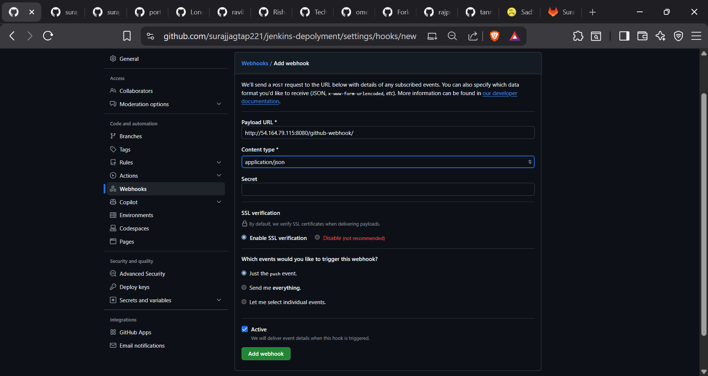
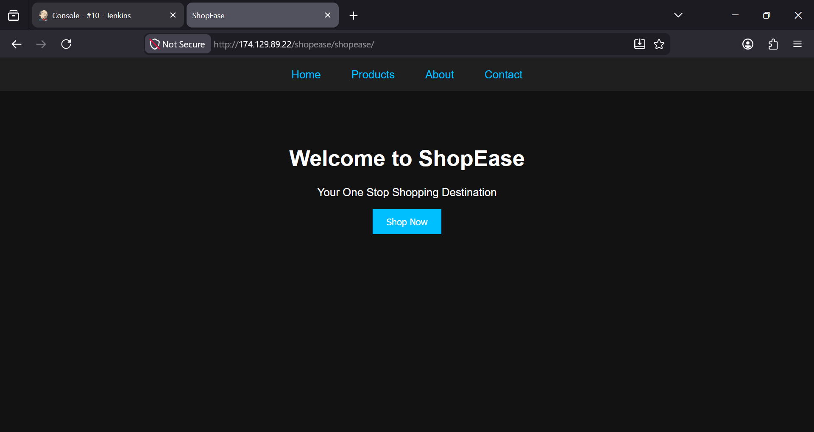
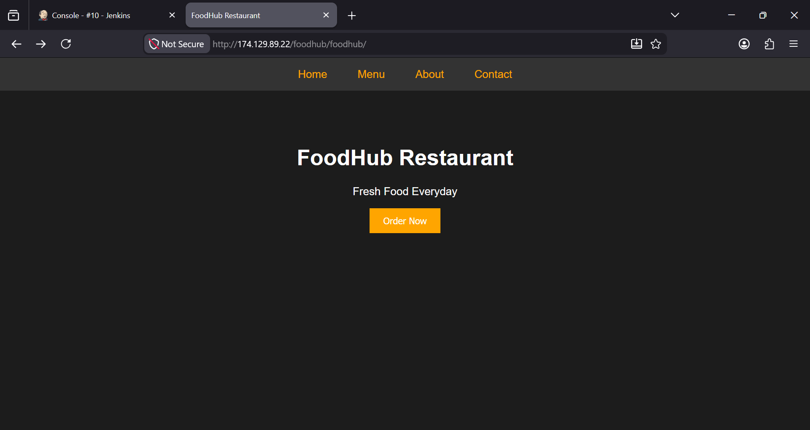
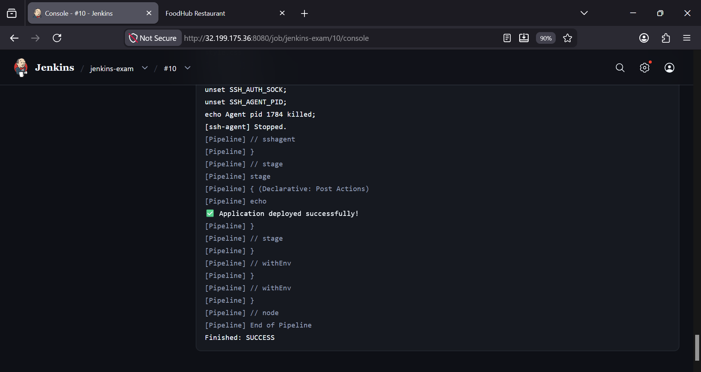
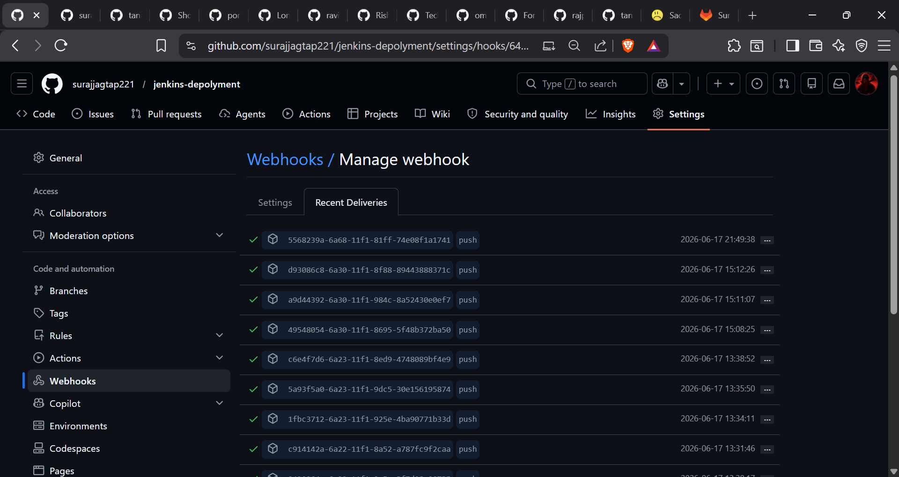
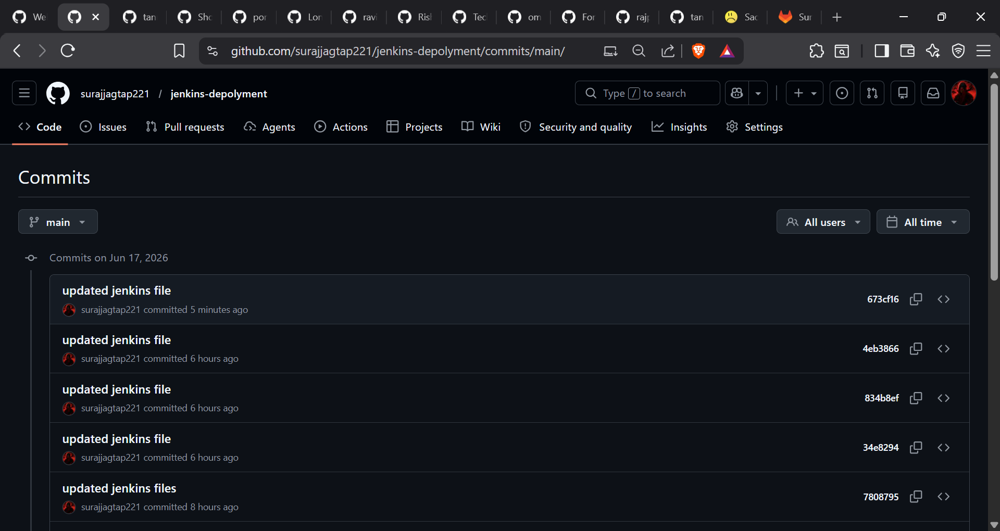
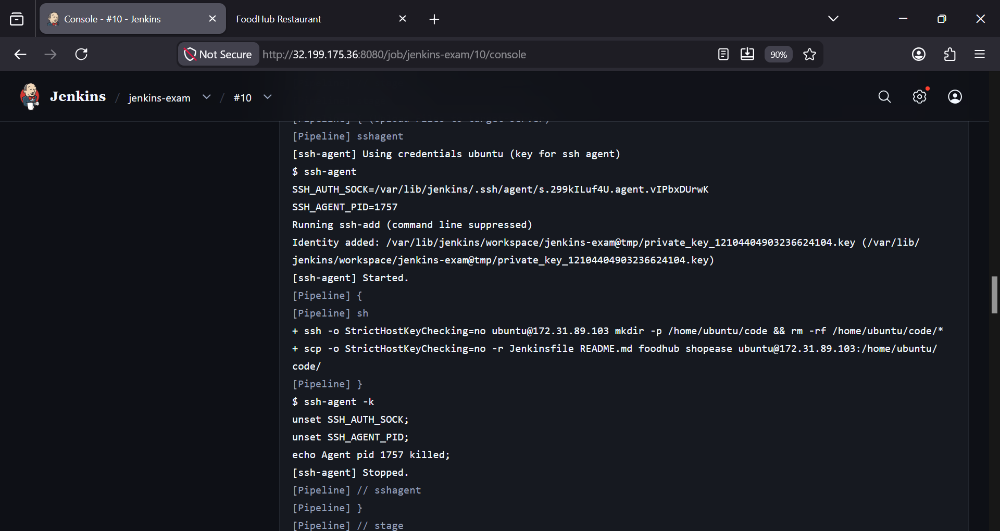
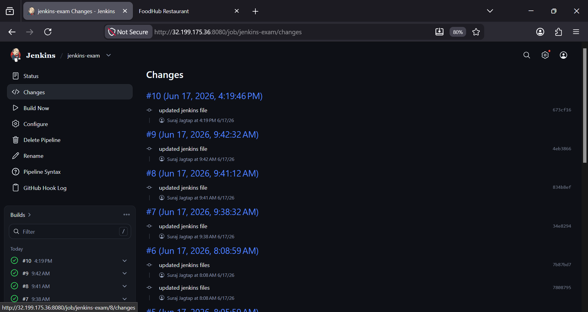

# Jenkins Exam Questions & Answers

## 1. What is Jenkins mainly used for?

- [ ] A. Server Monitoring
- [x] B. Continuous Integration and Continuous Delivery
- [ ] C. Database Management
- [ ] D. Container Orchestration

**Answer:** B. Continuous Integration and Continuous Delivery

---

## 2. Which type of job allows you to define build steps using code in Jenkins?

- [ ] A. Freestyle Project
- [x] B. Pipeline Project
- [ ] C. Multi-Configuration Project
- [ ] D. External Job

**Answer:** B. Pipeline Project

---

## 3. Which file is used to define a pipeline in Jenkins?

- [ ] A. pipeline.yaml
- [ ] B. dockerfile
- [x] C. Jenkinsfile
- [ ] D. build.gradle

**Answer:** C. Jenkinsfile

---

## 4. What is the purpose of a Jenkins Agent (Node)?

- [ ] A. To store source code
- [x] B. To execute jobs assigned by the Jenkins controller
- [ ] C. To manage plugins
- [ ] D. To configure webhooks

**Answer:** B. To execute jobs assigned by the Jenkins controller

---

## 5. Which plugin is required to connect Jenkins with GitHub?

- [ ] A. Docker Plugin
- [x] B. Git Plugin
- [ ] C. Kubernetes Plugin
- [ ] D. Maven Plugin

**Answer:** B. Git Plugin

---

## 6. What is the purpose of a Webhook in Jenkins CI/CD?

- [ ] A. To install plugins
- [x] B. To trigger builds automatically on code push
- [ ] C. To secure Jenkins server
- [ ] D. To restart Jenkins

**Answer:** B. To trigger builds automatically on code push

---

## 7. Which command is used inside Jenkins Pipeline to execute shell commands?

- [ ] A. bash
- [ ] B. cmd
- [x] C. sh
- [ ] D. run

**Answer:** C. sh


---

## 8. What is the purpose of the `post` block in Jenkins Pipeline?

- [ ] A. Define environment variables
- [x] B. Execute steps after pipeline stages
- [ ] C. Define agents
- [ ] D. Install plugins

**Answer:** B. Execute steps after pipeline stages


---

## 9. What is the use of `sshagent` in Jenkins Pipeline?

- [ ] A. Install SSH on server
- [ ] B. Store SSH keys
- [x] C. Use stored SSH credentials during execution
- [ ] D. Restart SSH service

**Answer:** C. Use stored SSH credentials during execution


---

## 10. What happens if a stage fails in Jenkins Pipeline (by default)?

- [ ] A. The pipeline continues to next stage
- [x] B. The pipeline stops execution
- [ ] C. Jenkins restarts automatically
- [ ] D. All stages are skipped but marked successful

**Answer:** B. The pipeline stops execution

---

# Jenkins CI/CD Practical Test

You are hired as a Junior DevOps Engineer in a startup organization. The development team has already created two static websites and stored their code in GitHub repositories.
Your task is to set up CI/CD pipelines using Jenkins and automatically deploy both applications on the same target server.
You are responsible for complete automation and troubleshooting.

## Application Repositories

### Application 1: FoodHub Restaurant Website
**Repository:**
`https://github.com/iamtruptimane/FoodHub-Restaurant-Website.git`

**Clone command:**
```bash
git clone https://github.com/iamtruptimane/FoodHub-Restaurant-Website.git
```

### Application 2: ShopEase Website
**Repository:**
`https://github.com/iamtruptimane/ShopEase-Website.git`

**Clone command:**
```bash
git clone https://github.com/iamtruptimane/ShopEase-Website.git
```

## Task 1: Infrastructure Setup

Create two Linux servers:

### Jenkins Server
- Install Java
- Install Jenkins
- Install required plugins
- Configure SSH credentials
- Verify Jenkins is accessible via browser

### Target Server
- Install Nginx
- Open port 80
- Ensure websites are accessible from browser

## Task 2: Deploy Both Applications on the Same Server

Deploy both applications on the same target server.

**Expected URLs:**
- `http://<Target-Server-IP>/foodhub`
- `http://<Target-Server-IP>/shopease`

**Expected deployment paths:**
- `/var/www/html/foodhub`
- `/var/www/html/shopease`

Configure Nginx accordingly.

## Task 3: Create Jenkins Pipeline Jobs

Create two separate Jenkins Pipeline jobs:
1. `FoodHub-Pipeline`
2. `ShopEase-Pipeline`

Each pipeline should:
- Clone code from GitHub
- Copy files to target server
- Restart Nginx if required
- Verify deployment

## Task 4: Configure GitHub Webhooks

Configure GitHub webhooks for both repositories such that:
- Any push to GitHub automatically triggers Jenkins.
- Jenkins deploys the latest code to the target server.

## Task 5: Make Required Changes

### FoodHub Website
**Modify:**
```text
Fresh Food Everyday
```
**To:**
```text
Delicious Food Delivered Fast
```
- Commit and push the changes.
- Verify automatic deployment.

### ShopEase Website
**Modify:**
```text
Welcome to ShopEase
```
**To:**
```text
Welcome to ShopEase Online Store
```
- Commit and push the changes.
- Verify automatic deployment.

## Task 6: Troubleshooting

If deployment fails, investigate and resolve the issue. Possible areas to check:
- Jenkins logs
- Build history
- SSH connectivity
- Nginx status
- File permissions
- Security Group rules
- GitHub webhook delivery
- Jenkins credentials
- Deployment path
- Port accessibility

## Bonus Task

Configure Nginx so that:
- `http://<Target-Server-IP>/foodhub` opens the FoodHub website
- `http://<Target-Server-IP>/shopease` opens the ShopEase website without using different ports.

## Pipeline Implementation & Expected Output

The repository includes a fully configured [Jenkinsfile](file:///c:/srj412305_workspace/jenkins/jenkins-depolyment/Jenkinsfile) that automates the deployment of both the **FoodHub** and **ShopEase** web applications onto a single target server. Below is a breakdown of the pipeline structure, configuration, and expected deployment output.

### 1. Pipeline Environment Configuration

The pipeline defines the following environment variables:

| Variable Name | Value | Description |
| :--- | :--- | :--- |
| `SERVER_IP` | `172.31.89.103` | IP address of the target server where Nginx is hosted. |
| `SSH_CREDENTIAL` | `node-app-ssh-key` | Jenkins credential ID containing the private key for SSH/SCP authentication. |
| `REPO_SHOPEASE` | `https://github.com/surajjagtap221/ShopEase-Website.git` | Source repository URL for the ShopEase application. |
| `REPO_FOODHUB` | `https://github.com/surajjagtap221/FoodHub-Restaurant-Website.git` | Source repository URL for the FoodHub application. |
| `BRANCH` | `main` | Target Git branch to clone for both repositories. |
| `REMOTE_USER` | `ubuntu` | SSH user profile on the target server. |
| `REMOTE_PATH` | `/home/ubuntu/code` | Target staging directory on the remote server. |
| `REMOTE_PATH_SHOPEASE` | `/home/ubuntu/code/shopease` | Subdirectory for ShopEase files on the remote server. |
| `REMOTE_PATH_FOODHUB` | `/home/ubuntu/code/foodhub` | Subdirectory for FoodHub files on the remote server. |

---

### 2. Stages Execution Flow

The pipeline executes sequentially in three primary stages:

#### **Stage 1: Clone Repositories**
* **Action:** Clones the repositories into dedicated subdirectories within the Jenkins workspace:
  * ShopEase is cloned into `./shopease`
  * FoodHub is cloned into `./foodhub`
* **Log Verification:** Runs `ls -R` to recursively list the cloned structure and verify the repository files.

#### **Stage 2: Upload Files to target-server**
* **Action:** Uses `sshagent` with `node-app-ssh-key` to securely:
  1. Create the staging directory `/home/ubuntu/code` on the target server.
  2. Clear any old deployment files from `/home/ubuntu/code/*`.
  3. Transfer the entire workspace contents (both directories) using `scp -r` to the staging directory `/home/ubuntu/code/`.

#### **Stage 3: Install Dependencies & Start App on the target server**
* **Action:** Accesses the target server via SSH to execute setup and hosting scripts:
  1. Installs and configures Nginx server (`sudo apt update && sudo apt install -y nginx`).
  2. Stops any running Apache server to prevent port conflicts (`sudo systemctl stop apache2`).
  3. Clears the default Nginx webroot directory (`sudo rm -rf /var/www/html/*`).
  4. Configures and runs Nginx (`sudo systemctl enable nginx && sudo systemctl start nginx`).
  5. Copies the staged application directories (`shopease` and `foodhub`) directly into the webroot:
     ```bash
     sudo cp -r /home/ubuntu/code/* /var/www/html/
     ```
  6. Recursively lists `/var/www/html/` to ensure all files are in place, and restarts Nginx (`sudo systemctl restart nginx`).

---

### 3. Expected Output & Access URLs

Upon successful execution of the Jenkins pipeline:

> [!NOTE]
> Since the applications are copied from `/home/ubuntu/code/*` to `/var/www/html/`, Nginx automatically hosts both static applications concurrently on Port 80 via subdirectory routing.

* **Deployment Paths on Target Server:**
  * **ShopEase Web App:** `/var/www/html/shopease/`
  * **FoodHub Web App:** `/var/www/html/foodhub/`

* **Expected Access URLs:**
  * **ShopEase Home:** `http://172.31.89.103/shopease/`
  * **FoodHub Home:** `http://172.31.89.103/foodhub/`

* **Console Logs Notification:**
  * **Success:** `✅ Application deployed successfully!`
  * **Failure:** `❌ Deployment failed.`

---

## Deliverables

Students must submit:
1. Jenkins pipeline screenshots
2. GitHub webhook configuration screenshot
3. Browser output of both applications
4. Jenkins build success screenshot
5. GitHub commit history
6. Target server deployment proof

---

## Project Screenshots
















